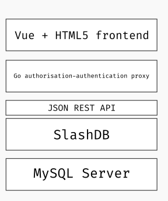
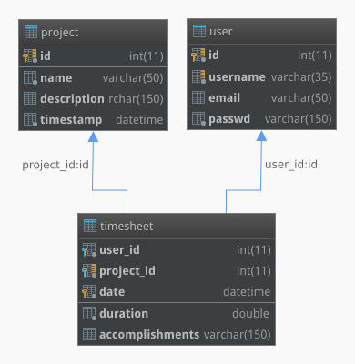
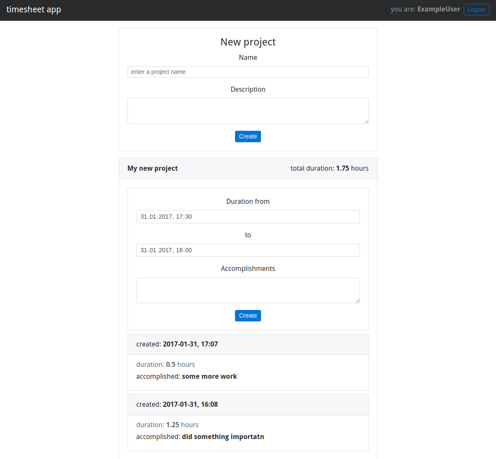

# Building a simple timesheet app with SlashDB, Go and Vue

We will be building a simple poof of concept, time tracking app and basing it on a [SlashDB](https://www.slashdb.com/) powered API. 
The app itself will allow users to register, login/logout, add new *projects*, add *tasks* to those projects and 
it will automatically sum-up the time a given project has taken.

## Requirements
* [SlashDB](https://www.slashdb.com/) >= 0.9.15
* [Go](https://golang.org/dl/) >= 1.7.4
* [Vue](https://vuejs.org/v2/guide/installation.html) >= 2.1.10

## The Code
All the code refereed in this article is available at the [bitbucket GIT repository](https://bitbucket.org/slashdb/timesheet/src).

## The timesheet app layout


What the developer needs to implement is, the frontend GUI 
and a way to do authentication/authorization for the user.
The RESTful API part is provided to us for free by [SlashDB](https://www.slashdb.com/).

## SlashDB
SlashDB can automatically generates a REST API from relational databases making it easy to access and modify our data. 
In general, it will save a lot of work coding my own data API-s.

## Go
[Go](https://golang.org/) (Golang for search engines) is a language by Google, often used as a (micro)service building tool. 
It has (most) batteries included, allowing us to build a simple authentication layer between our data and the frontend. 
It's also a compiled language i.e. we can build statically linked binaries for easy distribution and even embed our assets (CSS, JS etc) 
into that binary.

## Vue
After my experience with Angular 1.x (and a bit of React), 
I choose [Vue](https://vuejs.org/) - a small and simple front-end js framework. 
It's somewhere between those two frameworks (but a lot closer to React) and 
only focuses on the V(iew) part of MVC. 
Similar to Angular, we have things like template directives (i.e. *ng-for="item in items"* -> *v-for="item in items"*) -  
so no cumbersome JSX transpilation (a big plus - at least for me). 
And similar to React, we get one-way data flow i.e. always parent -> child node communication (so harder to achieve the level of Angular app craziness). 
In general it's easier to understand what our app is doing at a given time, also we get the awesome [dev tools](https://github.com/vuejs/vue-devtools) :)

### SlashDB Service
> **Important**: This part requires you to understand the basic of *SQL* and DB server setup 
(if you choose to use something other thant SQLite).

For development purposes, SlashDB is [available for free use](https://www.slashdb.com/download/) 
and I recommend using the [docker](https://docs.slashdb.com/user-guide/docker.html) image for an fast way to get started.

```
$ docker pull slashdb/slashdb
$ mkdir timesheet-docker
$ cd timesheet-docker
$ wget -c http://downloads.slashdb.com/v0.9/default-slashdb-configs_0.9.15.zip
$ unzip default-slashdb-configs_0.9.15.zip
$ docker run -d -p 8000:80 -v $PWD/slashdb:/etc/slashdb -v $PWD/slashdb:/var/log/slashdb slashdb/slashdb
```

Go to [http://localhost:8000/](http://localhost:8000/) and follow the initial developer setup wizard.

Now we need to create a database, in this example I'll be using MySQL, but any [DB engine supported by SlashDB](https://www.slashdb.com/pricing/) will do. 
Installing/configuring MySQL server is outside of scope of this article, so I'll just skip this part. 
For the timesheet app we'll need a database (preferably named *timesheet*), 
a user with read/write privileges, to said DB and 3 tables: *project*, *user* and *timesheet*.

```sql
DROP TABLE IF EXISTS project;
CREATE TABLE `project` (
  `id` int(11) NOT NULL AUTO_INCREMENT,
  `name` varchar(50) NOT NULL,
  `description` varchar(150) DEFAULT NULL,
  `timestamp` datetime NOT NULL DEFAULT CURRENT_TIMESTAMP,
  PRIMARY KEY (`id`),
  UNIQUE KEY `project_id_uindex` (`id`)
) ENGINE=InnoDB DEFAULT CHARSET=utf8;


DROP TABLE IF EXISTS user;
CREATE TABLE `user` (
  `id` int(11) NOT NULL AUTO_INCREMENT,
  `username` varchar(35) NOT NULL,
  `email` varchar(50) DEFAULT NULL,
  `passwd` varchar(150) NOT NULL,
  PRIMARY KEY (`id`),
  UNIQUE KEY `user_id_uindex` (`id`),
  UNIQUE KEY `user_username_uindex` (`username`)
) ENGINE=InnoDB DEFAULT CHARSET=utf8;


DROP TABLE IF EXISTS timesheet;
CREATE TABLE `timesheet` (
  `user_id` int(11) NOT NULL,
  `project_id` int(11) NOT NULL,
  `date` datetime NOT NULL DEFAULT CURRENT_TIMESTAMP,
  `duration` double NOT NULL,
  `accomplishments` varchar(150) DEFAULT NULL,
  PRIMARY KEY (`user_id`,`project_id`,`date`)
) ENGINE=InnoDB DEFAULT CHARSET=utf8;
```

This is MySQL-s SQL dialect, but it gives a general idea about the table layout 
and is easy enough to adjust for other SQL dialects.
This code is available as the file content of *timesheet.sql* in the [repository](https://bitbucket.org/slashdb/timesheet/src). 
Running it on your MySQL server will also provide you with some basic data (app user: *slashdb* and password: *slashdb*).

And if you prefer a diagram, heres one:



After we have our DB, tables and user setup we need to make SlashDB aware of it.
Going to [http://localhost:8000/](http://localhost:8000/) and logging-in as the *admin*,
we can [config and add our database endpoint](https://docs.slashdb.com/user-guide/config-databases.html), 
for simplicity, I named the endpoint *timesheet*.
In this case, I also enabled the *Auto Discover* feature and provided credentials for my MySQL user.
Save and remembering to make sure the DB has connected without errors (green *Connected* status) and we're set.

It's a good idea to create a new user for remote access to our resources, 
so following the [docs](https://docs.slashdb.com/user-guide/config-users.html),
I'll add a user named - you guessed it - *timesheet*. 
Also as our proxy authorization/authentication app will connect to SlashDB directly it's a good 
to set an API key for that user - in this example: *timesheet-api-key*.
Finally, add our newly created data source to this users *Database Mappings* and *Save*. 
We need to log-in as the *timesheet* user, and check if we have access to our tables. 
The [project endpoint](http://localhost:8000/db/timesheet/project.html), 
should now display an empty table - but (hopefully) no errors.

Thats it - now you have your data provided as an RESTful API, curtesy of SlashDB :)

### GoLang proxy authorization/authentication app
> **Important**: This part requires you to understand some basics of programming in Go, 
its setup (i.e. [$GOPATH/$GOROOT(https://github.com/golang/go/wiki/GOPATH)]) 
and it's basic tooling (i.e. go get/build/install). Form more reference on that visit Go-s 
[wiki page](https://github.com/golang/).

The basic idea is to proxy all the request from the frontend to the SlashDB RESTful API 
and on the fly, do some resource authorization. 
Also we need to provide a way to create and authenticate *timesheet* app users.

In my setup, this app will have 4 endpoints.
```
/          - the SlashDB proxy
/app/      - the frontend app itself
/app/reg/  - user registration provider
/app/login/ - user login/token provider
```

In the spirit of keeping it simple, as a method of of providing a kind of stateless session, we'll use [JWT](https://jwt.io/).
The */app/login/* endpoint will check user credentials and if everything's OK, provide a *JWT* token.

First, things first lets install everything we'll need:
```
$ go get golang.org/x/crypto/pbkdf2
$ go get github.com/dgrijalva/jwt-go/...
$ go get github.com/jteeuwen/go-bindata/...
$ go get github.com/elazarl/go-bindata-assetfs/...
```

> Tip: you can just run the build.sh script to install all requirements and compile the app

#### Setting up authorization/authentication proxy
Using GoLangs builtin *httputil.ReverseProxy*, we create a lightweight reverse proxy:

```go
// for the full code, view auth.go source file
func setupProxy() {
	// get address for the SlashDB instance and parse the URL
	url, err := url.Parse(pa.SdbInstanceAddr)
	if err != nil {
		log.Fatalln(err)
	}

	// create a reverse proxy
	proxy := httputil.NewSingleHostReverseProxy(url)
	// make it play nice with https endpoints
	proxy.Transport = &http.Transport{
		TLSClientConfig: &tls.Config{InsecureSkipVerify: true},
	}

	proxyHandler := func(w http.ResponseWriter, r *http.Request) {
		// set API key for easy proxy-to-SDB communication
		q := r.URL.Query()
		q.Set(pa.ParsedSdbAPIKey, pa.ParsedSdbAPIValue)
		r.URL.RawQuery = q.Encode()
		...
	}
	// bind the proxy handler to "/"
	http.HandleFunc("/", authorizationMiddleware(proxyHandler))
}
```

So now, when requesting something from the default *localhost:8000* 
we'll get redirected to the root of the selected SlashDB instance 
i.e. requesting 
> http://localhost:8000/db/timesheet/project/project_id/1.json -> http://demo.slashdb.com/db/timesheet/project/project_id/1.json

and the response will be transparently returned to the us.

The *authorizationMiddleware* function applies all the authorization logic to the proxied requests i.e.
it extracts the *JWT* token and checks if it's valid and depending on the user permissions, allows or prohibits resource access.

```go
func authorizationMiddleware(fn func(http.ResponseWriter, *http.Request), secret []byte) func(w http.ResponseWriter, r *http.Request) {
	return func(w http.ResponseWriter, r *http.Request) {
		token, err := request.ParseFromRequest(r, request.OAuth2Extractor, func(token *jwt.Token) (interface{}, error) {
			// we simply check the token claims, but this is a good place
			// to parse the r.URL.Path or other request parameters
			// and determine if a given user can access requested data
			// i.e. check if user of ID = 8 can read /db/timesheet/project/project_id/2/ etc.
			mc := token.Claims.(jwt.MapClaims)
			_, ok := mc["id"]
			if !ok {
				return nil, fmt.Errorf("token lacks 'id' claim")
			}
			_, ok = mc["username"]
			if !ok {
				return nil, fmt.Errorf("token lacks 'username' claim")
			}

			...
			return secret, nil
		})

		if err != nil || !token.Valid {
			http.Error(w, http.StatusText(http.StatusUnauthorized), http.StatusUnauthorized)
			return
		}
		// else call the original handler function
		fn(w, r)
	}
}
```

In my example it's only a simple function, but of course, depending on the use case, we can implement 
any kind of authentication logic there.

#### /app/
The frontend app is being served from a static template and 
the rest is generated and managed by the Vue app.

```go
afs := &assetfs.AssetFS{Asset: Asset, AssetDir: AssetDir, AssetInfo: AssetInfo, Prefix: ""}
http.HandleFunc("/app/", func(w http.ResponseWriter, r *http.Request) {
	indexTmpl := template.New("index.html")
	data, err := afs.Asset("index.html")
	...
	_, err = indexTmpl.Parse(string(data))
	...
	indexTmpl.Execute(w, pa)
})
```

#### /app/static/
This little Go app also servers our static content

```go
afs := &assetfs.AssetFS{Asset: Asset, AssetDir: AssetDir, AssetInfo: AssetInfo, Prefix: ""}
...
fs := http.FileServer(afs)
http.Handle("/app/static/", http.StripPrefix("/app/static/", fs))
```

> Tip: during development, a lot of changes will happen in the assets, 
> so it would be nice not to have to rebuild the binary every time we change anything.
> It's good that go-bindata has a debug mode, running:
> ```go-bindata -debug ./assets/... index.html```
> will generate a *bindata.go* file, but mock assets with function calls that load 
> files form the HDD, when done debugging, just run *./build.sh*

#### /app/reg/
Before we can login we need a user, and for that we need to implement a way 
to register one. We also need to generate a password hash, 
store user info in the DB - so once again, SlashDB comes in handy here.

```go
...
encodedPass := genPassword(un+passwd, nil)
payload := map[string]string{
  "username": un,
  "passwd":   encodedPass,
  "email":    email,
}
data, err := json.Marshal(payload)
...
// by default:
// pa.SdbInstanceAddr = "https://demo.slashdb.com"
// pa.SdbDBName = "timesheet"
// pa.ParsedSdbAPIKey = "apikey"
// pa.ParsedSdbAPIValue = "timesheet-api-key"
req, _ = http.NewRequest("POST", pa.SdbInstanceAddr+"/db/"+pa.SdbDBName+"/user.json?"+pa.ParsedSdbAPIKey+"="+pa.ParsedSdbAPIValue, bytes.NewReader(data))
ureq, err := defaultClient.Do(req)
...

if ureq.StatusCode != http.StatusCreated {
  // something went wrong, provide some useful response to the user or just return what SlashDB has returned
}
w.WriteHeader(http.StatusCreated)
w.Write([]byte(fmt.Sprintf("User %q was created successfully!", un)))
```

Here we simply make a *POST* request to SlashDB-s /db/timesheet/user.json 
providing necessary info - no SQL required 
and if everything goes OK, well get a 201 (Created) status code and the URL of the new resource i.e.
"/db/timesheet/users/user_id/10".

#### /app/login/
This little apps 'session' relies on the *JWT* token, 
so we need to authorize the user, generate that token and send it back to the user.
This is done via *loginHandler* function and the token itself is generated, based on the user input 
(received via form data or URL params), in the *genJWTToken* function.

```go
var defaultSecret = []byte("timesheet app secret")

func genJWTToken(username string, id int, secret []byte) (string, error) {
	token := jwt.NewWithClaims(jwt.SigningMethodHS512, jwt.MapClaims{
		"username": username,
		"id":       id,
		"exp":      time.Now().Add(time.Hour * 24).Unix(),
	})
	if len(secret) == 0 {
		secret = defaultSecret
	}
	return token.SignedString(defaultSecret)
}
```

Then, if everything goes according to plan, we return the new token to the user.

```go
tc := struct {
  Token string `json:"accessToken"`
}{st}

td, err := json.Marshal(tc)
if err != nil {
  log.Printf("data: %v, error: %v", tc, err)
  http.Error(w, http.StatusText(http.StatusInternalServerError), http.StatusInternalServerError)
  return
}
w.Write(td)
```

On the frontend side, we set the *Authorization* header and store the 
token in *localStorage* for future use i.e.

```javascript
storeAuthInfo: function (authInfo) {
	// set authorization token for all the request done by the Vue app
    Vue.http.headers.common['Authorization'] = 'Bearer ' + authInfo.accessToken;
    this.authInfo = authInfo;
    this.userId = authInfo.payload.id;
    this.userName = authInfo.payload.username;
    localStorage.setItem(this.lsAuthInfoKey, JSON.stringify(authInfo));
}
```

Thanks to this we can make further requests, without explicitly managing this token by hand.
For instate when requesting user data.

```javascript
var userId = 'id taken form JWT token';
this.$http.get('http://localhost:8000/db/timesheet/user_id/' + userId + '.json'))
	.then(function(resp) {
		// do something on a successful response
	}, function(errResp) {
		// do something else on an error
	});
```
We just take care of handling responses/errors and don't bother with anything else.
The same goes for POST, PUT and DELETE requests - it's all supported by the SlashDB generated REST API.

## A few screenshots

### The registration view


### The main view


## CLI arguments for the app
In the *init()* function in *main.go* file, 
using the GoLang building lib *flag* package,
I've added some command line arguments to this small proxy app.
They allow for easy customization without recompiling the app 
(i.e. after deploying the binary to somewhere or giving it to someone).
Here's a fast overview of the available commands and their default values.

```
$ ./timesheet:
  -net-interface string
        network interface to serve on (default "localhost")
  -port uint
        local port to serve on (default 8000)
  -sdb-address string
        SlashDB instance address (default "https://demo.slashdb.com")
  -sdb-apikey string
        SlashDB user API key, key and value separated by single ':' (default "apikey:timesheet-api-key")
  -sdb-dbname string
        SlashDB DB name i.e. https://demo.slashdb.com/db/>>timesheet<< (default "timesheet")
```

## Building the app and bundling assets
Just run:
```
$ ./build.sh
```
and you'll end up with linux/max/win binaries - with all the assets bundled inside.


## Summary
If you want to play around with the code, it's available [here](https://bitbucket.org/slashdb/timesheet/src), 
and the pre-build binaries are [here](https://bitbucket.org/slashdb/timesheet/downloads).
